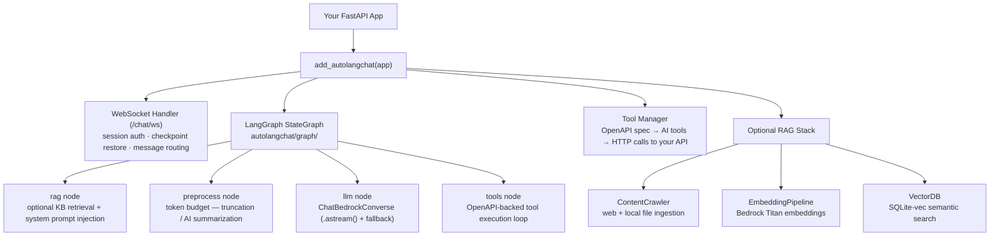
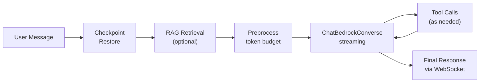

# autolangchat

🤖 **Automatically add AI chat capabilities to your FastAPI application with Amazon Bedrock integration**

Transform any FastAPI app into an intelligent AI assistant. The plugin reads your OpenAPI spec, generates AI-callable tools from your endpoints, and provides a real-time WebSocket chat interface powered by Amazon Bedrock — all with a single integration call.

This repository is still named `auto-bedrock-chat-fastapi`, but the actively developed runtime package is `autolangchat`.

[](https://badge.fury.io/py/auto-bedrock-chat-fastapi)
[](https://www.python.org/downloads/)

---

## ✨ Key Features

- **Zero-config tool generation** — OpenAPI spec → AI tools automatically
- **Framework-agnostic** — works with Express.js, Flask, Django, or any framework via an OpenAPI spec file
- **Real-time WebSocket chat** with a built-in web UI
- **Amazon Bedrock** support for Claude, GPT OSS, Llama, Titan, and other models
- **5 authentication methods** for securing AI tool calls (Bearer, Basic, API Key, OAuth2, Custom)
- **RAG support** — web crawler, vector DB, and embedding pipeline for knowledge-base-grounded responses
- **Smart token management** — automatic truncation and optional AI summarization to prevent context overflow

---

## 🚀 Quick Start

### Install

```bash
pip install git+https://github.com/gabrielbriones/auto-bedrock-chat-fastapi.git
```

### Add to Your App

```python
from fastapi import FastAPI
from autolangchat import add_autolangchat

app = FastAPI(title="My API")

@app.get("/products")
async def list_products():
    return [{"id": 1, "name": "Widget", "price": 9.99}]

# One line adds AI chat + WebSocket + built-in UI
add_autolangchat(app, allowed_paths=["/products"])
```

### Configure AWS (`.env`)

```bash
AWS_REGION=us-east-1
AWS_ACCESS_KEY_ID=your-key
AWS_SECRET_ACCESS_KEY=your-secret
AUTOCHAT_MODEL_ID=us.anthropic.claude-sonnet-4-6
```

### Run

```bash
uvicorn app:app --reload
```

Open `http://localhost:8000/chat/ui` and start chatting with your API.

### Using a Custom `lifespan`

`autolangchat` does not use FastAPI's deprecated `@app.on_event("startup")` /
`@app.on_event("shutdown")` hooks — per the
[ASGI lifespan spec](https://asgi.readthedocs.io/en/latest/specs/lifespan.html)
and [FastAPI's lifespan docs](https://fastapi.tiangolo.com/advanced/events/),
those hooks are silently skipped by FastAPI whenever the app defines its own
`lifespan` context manager, so relying on them is fragile. Instead, the
plugin exposes public `startup()` / `shutdown()` methods that **must** be
called explicitly from your app's `lifespan`:

```python
from contextlib import asynccontextmanager

from fastapi import FastAPI
from autolangchat import add_autolangchat

@asynccontextmanager
async def lifespan(app: FastAPI):
    plugin = getattr(app.state, "autolangchat_plugin", None)
    if plugin is not None:
        await plugin.startup()
    yield
    if plugin is not None:
        await plugin.shutdown()

app = FastAPI(title="My API", lifespan=lifespan)
app.state.autolangchat_plugin = add_autolangchat(app, allowed_paths=["/products"])
```

`plugin.startup()`:
1. Opens the LangGraph checkpointer connection pool and initialises the schema.
2. Schedules the background checkpoint-expiry sweep task.
3. Auto-populates the knowledge base (if configured).
4. Opens the feedback-store connection pool.
5. Schedules the KB credibility-decay background task (if enabled).

`plugin.shutdown()` tears down the same resources in reverse. Both methods
are idempotent — safe to call multiple times (e.g. `startup()` called twice
in a row is a no-op the second time), and `shutdown()` is a no-op if
`startup()` was never called.

If you use `create_fastapi_with_autolangchat()` instead of manually creating
the `FastAPI` app, this wiring is already done for you — its built-in
`lifespan` calls `plugin.startup()` / `plugin.shutdown()` automatically.

---

## 🏗️ Architecture



**Request flow:**



**Checkpointing:** Conversation state is persisted via LangGraph `MemorySaver` (Phase 1) or `AsyncPostgresSaver` (Phase 3), keyed by `session_id`.

---

## 📁 Source Code Structure

```
autolangchat/
├── plugin.py                        # Entry point: add_autolangchat(), create_fastapi_with_autolangchat()
├── app.py                           # Standalone app factory
├── config.py                        # ChatConfig — all settings via Pydantic + .env (AUTOCHAT_* vars)
├── defaults.py                      # Centralized default values (thresholds, timeouts, ratios)
├── exceptions.py                    # Custom exception types
├── models.py                        # Pydantic request/response models
├── websocket_handler.py             # WebSocket lifecycle; delegates to LangGraph graph
├── auth_handler.py                  # Authentication types and credential management
├── session_manager.py               # In-memory session lifecycle
├── message_preprocessor.py         # Two-stage token budget pipeline
├── kb_credibility.py                # KB source credibility scoring
├── graph/
│   ├── graph.py                     # build_chat_graph(config, tool_manager) → CompiledGraph
│   ├── state.py                     # ChatState(TypedDict)
│   ├── routing.py                   # should_continue() edge function
│   ├── checkpointer.py              # MemorySaver (Phase 1) / AsyncPostgresSaver (Phase 3)
│   ├── nodes/
│   │   ├── init_turn.py             # Turn initialization node
│   │   ├── rag.py                   # Optional KB retrieval + enhanced system prompt injection
│   │   ├── preprocess.py            # Wraps MessagePreprocessor — token budget stages
│   │   ├── llm_call.py              # ChatBedrockConverse node (.astream() + fallback model)
│   │   └── citation_boost.py        # Citation relevance boosting
│   └── tools/
│       ├── generator.py             # OpenAPI spec → tool schema generation
│       ├── manager.py               # Tool registry + LangChain tool execution
│       └── tool_node.py             # Tool-call execution node
├── admin/
│   ├── admin_auth.py                # Admin authentication
│   ├── admin_errors.py              # Admin error handlers
│   ├── admin_feedback_routes.py     # Feedback admin routes
│   ├── admin_kb_routes.py           # Knowledge base admin routes
│   ├── admin_synthesis_routes.py    # Synthesis admin routes
│   └── synthesizer.py               # Feedback synthesis logic
├── commands/
│   └── kb.py                        # KB CLI commands
├── sso/
│   ├── sso_handler.py               # SSO handlers (Azure AD, Okta)
│   └── sso_session_store.py         # SSO session storage
├── rag/
│   ├── content_crawler.py           # Web + local file ingestion
│   ├── embedding_pipeline.py        # Embedding ingestion pipeline
│   └── bedrock_embeddings.py        # Bedrock Titan embeddings client
├── db/
│   ├── feedback_base.py             # Abstract feedback store
│   ├── feedback_sqlite.py           # SQLite feedback store
│   ├── feedback_postgres.py         # Postgres feedback store
│   ├── kb_base.py                   # Abstract KB store
│   ├── kb_sqlite.py                 # SQLite KB store
│   ├── kb_postgres.py               # Postgres KB store
│   └── sql/                         # SQL schema files
├── templates/                       # Chat UI HTML templates
└── static/                          # Chat UI CSS and JS assets
```

---

## 📖 Documentation

Full documentation is in [`docs/wiki/`](docs/wiki/):

| Topic                        | Page                                                       |
| ---------------------------- | ---------------------------------------------------------- |
| System architecture          | [architecture.md](docs/wiki/architecture.md)               |
| All configuration settings   | [configuration.md](docs/wiki/configuration.md)             |
| FastAPI plugin integration   | [fastapi-plugin.md](docs/wiki/fastapi-plugin.md)           |
| OpenAPI / framework-agnostic | [openapi-integration.md](docs/wiki/openapi-integration.md) |
| Tool calling & generation    | [tool-calling.md](docs/wiki/tool-calling.md)               |
| Built-in Chat UI             | [chat-ui.md](docs/wiki/chat-ui.md)                         |
| WebSocket client script      | [websocket-client.md](docs/wiki/websocket-client.md)       |
| Authentication methods       | [authentication.md](docs/wiki/authentication.md)           |
| Single Sign-On               | [sso.md](docs/wiki/sso.md)                                 |
| RAG (crawler + vector DB)    | [rag-feature.md](docs/wiki/rag-feature.md)                 |
| Feedback collection          | [feedback-collection.md](docs/wiki/feedback-collection.md) |
| Admin API                    | [admin-api.md](docs/wiki/admin-api.md)                     |
| Feedback synthesis           | [feedback-synthesis.md](docs/wiki/feedback-synthesis.md)   |
| Token management             | [token-management.md](docs/wiki/token-management.md)       |
| CI pipelines                 | [ci-pipelines.md](docs/wiki/ci-pipelines.md)               |
| CD / deployment              | [cd-pipelines.md](docs/wiki/cd-pipelines.md)               |

---

## Dependency Management

The canonical source of truth for dependencies is [`pyproject.toml`](pyproject.toml), managed via [Poetry](https://python-poetry.org/).

[`requirements.txt`](requirements.txt) is a pip-compatible export derived from `poetry.lock`. It is used by CI pipelines and consumers (e.g. other repositories that install this package via pip). **Do not edit `requirements.txt` manually.**

After adding, removing, or updating any dependency in `pyproject.toml`, regenerate `requirements.txt`:

```bash
poetry export -f requirements.txt --without-hashes --output requirements.txt
```

A CI check in the `Code Quality` workflow will fail if `requirements.txt` is out of sync with `poetry.lock`.

---

## 🔧 Requirements

- Python >=3.10, <4.0
- FastAPI 0.100+
- AWS account with Bedrock access enabled
