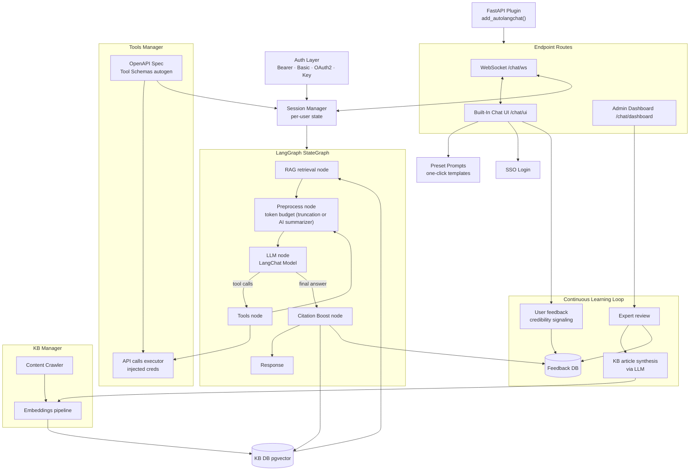

<!-- _class: title -->

# Accelerating CPU Simulation Workload Analysis with Conversational AI

## AutoLangChat · Intel Workload Analyzer

&nbsp;

**Gabriel Briones** · Intel Guadalajara
AI Community of Practice · 2026

---

# Agenda

1. **Context** — ISS in one slide + the problem
2. **AutoLangChat** — What it is, architecture, three ways to use it
3. **This applies to your team** — Any REST API, any domain
4. **Intel Workload Analyzer** — Production deployment on ISS
5. **What We Learned** — The hard parts of LLM integration
6. **Continuous Learning Loop** — Making responses better over time
7. **Impact & Takeaways**

---

<!-- _class: section-break -->

# Context

## Intel Simulation Service + The Problem

---

# Intel® Simics® Service (ISS)

ISS is Intel's **cloud SaaS platform** for CPU simulation — engineers submit jobs, ISS provisions Simics-based virtual platforms, results are served via a REST API. No on-prem infrastructure required.

**The simulation toolkit:**

| Tool              | Role                                                                                                                              |
| ----------------- | --------------------------------------------------------------------------------------------------------------------------------- |
| **IWPS**          | Parallel x86 microarchitectural simulator (formerly Sniper) — IPC, cache, branch, SIMD profiling across GNR/EMR/DMR/SRF platforms |
| **Coho**          | Cycle-accurate core simulator from trace files — CPI, L1/L2/L3 MPKI per thread                                                    |
| **EMON**          | Hardware PMU counter collection on real silicon — the ground truth baseline                                                       |
| **ControllerJob** | Parent job that spawns a parameter sweep (frequency × cache size grid)                                                            |

---

# The Problem

A performance engineer analyzing a 20-point parameter sweep must:

1. Query ISS REST API → list child job IDs
2. Download `sim.out` + 6 profiler files × 20 jobs = **120+ file downloads**
3. Parse per-function instruction mix, cache miss rates, branch profiles
4. Download EMON `perf_stat_*.json` → correlate against simulation
5. Apply domain rules correctly (Aggregated IPC ≠ per-core avg; PlatformID ≠ CPU arch)
6. Write a characterization report per config point, per architecture

> The data exists. The tools exist. **The interface that makes it accessible to everyone is missing.**

**Scale bottleneck:** analysis throughput is capped by available expert bandwidth — not by compute.

---

<!-- _class: section-break -->

# AutoLangChat

---

# What is AutoLangChat?

> A zero-configuration **plugin framework** that converts any OpenAPI-described REST service into a production-grade conversational and agentic AI interface — powered by **any LLM supported by LangChain**.

**One line of integration:**

```python
from autolangchat import add_autolangchat

app = FastAPI(title="My Service")
# ... your existing routes ...

add_autolangchat(app, allowed_paths=["/jobs", "/platforms", "/files"])
```

No custom transport, session management, authentication forwarding, or tool schema code.

**Intel deployment:** Claude Sonnet 4 via Amazon Bedrock · LangGraph orchestration · any LangChain-compatible model (OpenAI, Anthropic, Ollama, Azure…)

---

# Architecture



---

# How Tool Generation Works

AutoLangChat reads your OpenAPI spec at startup and compiles each operation into a Claude-callable tool automatically:

```
GET /jobs?status=completed&limit=50  →  list_jobs(status, limit)
GET /files/{job_id}?path=sim.out  →  download_job_file(job_id, path)
POST /batch/analyze  →  run_batch_analysis(job_ids, config)
```

Claude decides which tools to call, in what order, based on the user's natural language question.

**Engineers write zero tool schema code.**

---

# Three Ways to Use AutoLangChat

**① Built-in Chat UI** — open `/chat/ui` in a browser, zero setup

**② WebSocket client** — integrate into any tool or pipeline:

```python
client = WebSocketChatClient(WebSocketConfig(
    endpoint="ws://my-service/chat/ws",
    auth_type=AuthType.BEARER_TOKEN, token="..."))
await client.connect()
await client.send_chat_message("Analyze hotspots in job abc-123")
```

**③ Direct graph invocation** — use the agent in CI pipelines, notebooks, batch jobs:

```python
from autolangchat import build_chat_graph

graph = build_chat_graph(config, tool_manager=tool_manager)
result = await graph.ainvoke(
    {"messages": [{"role": "user", "content": "Generate report for jobs A, B, C"}],
     "metadata": {}},
    config={"configurable": {"thread_id": "pipeline-run-42", "auth_info": auth}},
)
report = result["messages"][-1]["content"]
```

> Not just a chat UI — a **programmable AI agent**.

---

<!-- _class: section-break -->

# Does Your Team Have a REST API?

---

# This Applies to Your Team

AutoLangChat works with **any** service that has an OpenAPI spec — not just simulation platforms.

```python
# EDA tool REST API
add_autolangchat(app, spec_file="eda_openapi.yaml")
# → "Show me all failed DRC runs for design X this week"

# IP catalog service
add_autolangchat(app, spec_file="ip_catalog_openapi.yaml")
# → "Which verified IPs support DDR5 with ECC on EMR?"

# Verification platform
add_autolangchat(app, spec_file="vp_openapi.yaml")
# → "Compare coverage reports between regression runs 142 and 143"
```

**If your team has a REST API with an OpenAPI spec, you can add a conversational AI interface in an afternoon** — without modifying the underlying service.

> Intel is a HW company. Most HW design workflows expose REST APIs for data access. AutoLangChat is the missing AI layer on top of them.

---

<!-- _class: section-break -->

# Intel Workload Analyzer

## AutoLangChat deployed on ISS

---

# Intel Workload Analyzer

AutoLangChat deployed on top of the ISS REST API. Engineers interact in natural language:

> _"Show my last 10 completed IWPS jobs"_ > _"Identify the top 3 hottest functions in job X with cycle percentages"_ > _"Which functions use AVX-512 vs AVX2?"_ > _"Generate a characterization report for jobs A, B, C with EMON correlation"_ > _"Recommend compiler flags for my EMR workload"_

The assistant fetches data, parses artifacts, computes metrics, and delivers a structured analysis — **all in a single conversation turn**.

---

# Batch Characterization: Before vs After

**Before:** A senior engineer downloads and correlates 120+ files, applies domain rules manually, writes a report. **~4 hours.**

**After:**

1. Provide a parent controller job ID
2. AutoLangChat downloads all `sim.out` + profiler files, validates data quality, pre-computes metrics
3. Claude generates a full engineering white paper — scaling tables, bottleneck analysis, EMON correlation, compiler recommendations

**Under 2 minutes.**

---

# Data Quality Guard

Before any analysis, metrics are validated automatically:

```
sim.out → consistency checks
    ├── IPC < 0.1 and idle > 95%?       → flag: idle ROI capture
    ├── Instruction count < 1M?         → flag: premature ROI exit
    ├── Errors in sim.stdout?           → flag: workload crash
    └── Config mismatch indicators?     → flag: wrong parameters
```

Flagged jobs trigger a **root-cause report** — Claude cites specific `sim.stdout` lines and classifies the failure — instead of silently producing misleading numbers.

> **This was not trivial to build.** The LLM had to be taught what "suspicious" means in this domain.

---

<!-- _class: section-break -->

# What We Learned

## The hard parts of LLM integration

---

# Lesson 1: Token Budget Engineering is Real

A single batch analysis = ~780KB of raw JSON — far beyond any context window.

**Solution: pre-process before every LLM call**

```
Raw data (780KB)
    │
    ├── Trim   → strip EMON rows arrays, keep summaries only       → ~40KB
    ├── Compute → IPC, MPKI, deltas, bottleneck labels pre-computed → ~8KB structured
    └── Summarize → if history still overflows, AI summarizes old turns
```

The LLM never sees raw JSON. It sees **structured summaries computed deterministically**.

> Rule of thumb: compute what you can deterministically. Use the LLM only for what requires language reasoning.

---

# Lesson 2: Domain-Correct Prompting is Non-Trivial

LLMs make systematic domain errors without explicit guidance:

| The mistake                                | The correct rule                                                             |
| ------------------------------------------ | ---------------------------------------------------------------------------- |
| Average per-core IPC                       | Aggregated IPC = total instr ÷ (n_cores × cycles)                            |
| Report `PlatformID` as CPU architecture    | Read `config_options["simulation-platform"]` — "dmr" = Diamond Rapids        |
| Diagnose low IPC as a workload problem     | First check if ROI captured idle phase in `sim.stdout`                       |
| Assume sim and HW run on same architecture | EMON is from production silicon — often a different arch than the sim target |

**Each of these was discovered in production, not in testing.**

> The system prompt is engineering work, not a prompt. It encodes domain expertise.

---

# Lesson 3: Credentials Must Never Touch the Model

```
User connects → AutoLangChat stores token server-side
                          │
                  Claude decides to call:
                  download_job_file(job_id, path)
                          │
              Tool executor injects token → ISS API call
                          │
              Claude receives: file content only
```

**The model sees data. Never secrets.**

This is a hard architectural requirement — not a guideline. Any design where credentials pass through the LLM context is a security violation regardless of how well the model behaves.

---

<!-- _class: section-break -->

# Continuous Learning Loop

---

# Making Responses Better Over Time

The problem: switching models or fine-tuning doesn't fix domain reasoning errors at Intel scale.

**The approach: a governed feedback loop**

```
Engineer rates an answer (thumbs up/down + correction)
        │
        ▼
Feedback queue → Expert review (mandatory quality gate)
        │
        ▼ (approved only)
LLM synthesizes a KB article from the correction
        │
        ▼
Knowledge base updated → RAG retrieves it on future queries
        │
        ▼
Better responses → better feedback → virtuous cycle
```

> Without expert review: wrong corrections become authoritative context, errors amplify.
> With expert review: only validated knowledge reaches the model.

---

<!-- _class: section-break -->

# Impact & Takeaways

---

# What Engineers Can Do Today

| Task                            | Before AutoLangChat         | After                    |
| ------------------------------- | --------------------------- | ------------------------ |
| List + filter jobs              | REST API + JSON parsing     | One sentence             |
| Hotspot function analysis       | Download + parse insprofile | One sentence             |
| Batch characterization report   | ~4 hours of expert work     | ~2 minutes               |
| EMON vs sim correlation         | Manual metric alignment     | Automated                |
| Root-cause a bad simulation run | Expert log reading          | Automated classification |
| Compiler flag recommendations   | Domain knowledge required   | Conversational           |

---

# Key Takeaways

1. **The interface gap is the bottleneck** — the data and tools already exist at Intel; natural language is the missing layer

2. **OpenAPI spec is the integration surface** — if your team has a REST API, you're 80% of the way there

3. **Compute deterministically, reason linguistically** — pre-process everything you can before the LLM call

4. **Domain-correct prompting is engineering** — the system prompt encodes expertise; it takes iteration to get right

5. **Credentials must never touch the model** — design for this from day one

6. **Governed feedback beats retraining** — expert-approved corrections improve the system without model changes

---

<!-- _class: dark -->

# Demo

&nbsp;

**Intel Workload Analyzer — Live**

- List recent IWPS jobs
- Hotspot + vectorization analysis
- Batch characterization report with EMON correlation
- Root-cause analysis on a flagged job

---

<!-- _class: title -->

# Thank You

&nbsp;

**Gabriel Briones** · Intel Guadalajara
`gabrielbriones@intel.com`

&nbsp;

**AutoLangChat** · LangGraph · any LangChain-compatible LLM
`pip install git+https://github.com/gabrielbriones/auto-bedrock-chat-fastapi.git`

&nbsp;

_AI Community of Practice · Intel Guadalajara · 2026_

---

<!-- _class: dark -->

# Demo

&nbsp;

**Intel Workload Analyzer — Live**

- List recent IWPS jobs
- Hotspot + vectorization analysis
- Batch characterization report with EMON correlation
- Root-cause analysis on a flagged job

---

<!-- _class: title -->

# Thank You

&nbsp;

**Gabriel Briones** · Intel Guadalajara
`gabrielbriones@intel.com`

&nbsp;

**AutoLangChat**
`pip install git+https://github.com/gabrielbriones/auto-bedrock-chat-fastapi.git`

&nbsp;

_AI Community of Practice · Intel Guadalajara · 2026_

---

# Appendix: AutoLangChat Quick Start

```python
from fastapi import FastAPI
from autolangchat import add_autolangchat

app = FastAPI(title="My API")

@app.get("/products")
async def list_products():
    return [{"id": 1, "name": "Widget"}]

add_autolangchat(app, allowed_paths=["/products"])
```

```bash
# .env
AWS_REGION=us-east-1
AUTOCHAT_MODEL_ID=us.anthropic.claude-sonnet-4-6

uvicorn app:app --reload
# → open http://localhost:8000/chat/ui
```

---

# Appendix: ISS Data Produced Per Job

**IWPS / Simulation outputs:**

| File                | Contains                                                               |
| ------------------- | ---------------------------------------------------------------------- |
| `sim.out`           | Aggregated IPC, CPI, L1D/LLC MPKI, instruction count, cycle count      |
| `sim.insprofile`    | Per-function instruction mix — AVX2 / AVX-512 / scalar breakdown       |
| `sim.memoryprofile` | Per-function memory access patterns and cache miss rates               |
| `sim.branchprofile` | Branch instruction counts and miss rates per function                  |
| `sim.stdout`        | Raw simulator log — ROI markers, Sniper stats, workload console output |

**EMON (real silicon baseline):**

| File               | Contains                                               |
| ------------------ | ------------------------------------------------------ |
| `perf_stat_*.json` | PMU counters: IPC, DRAM BW, cache events, TLB pressure |

---

# Appendix: Key ISS Metrics

| Metric               | Source              | Note                                                |
| -------------------- | ------------------- | --------------------------------------------------- |
| **Aggregated IPC**   | `sim.out`           | total instr ÷ (n_cores × cycles) — NOT per-core avg |
| **L1D / LLC MPKI**   | `sim.out`           | Misses per 1000 instructions                        |
| **Branch miss rate** | `sim.branchprofile` | Branch predictor efficiency                         |
| **SIMD utilization** | `sim.insprofile`    | AVX2 vs AVX-512 vs scalar mix                       |
| **DRAM BW**          | EMON `perf_stat`    | Real silicon bandwidth saturation                   |
| **Sim vs HW delta**  | Both                | Simulation fidelity assessment                      |

---

# Appendix: Updated Abstract

CPU performance simulation at Intel spans tools such as IWPS, Simics, Coho, and EMON, yet extracting actionable insights has traditionally required engineers to manually query multiple REST APIs and parse profiler artifacts — a process demanding both time and deep domain expertise. This talk presents **AutoLangChat**, a plugin framework that converts any OpenAPI-described REST service into a conversational and agentic AI interface, and describes its production deployment as the Intel Workload Analyzer on the Intel Simulation Service (ISS). Without any custom transport, session, or authentication code from the ISS team, AutoLangChat enables engineers to identify hotspot functions, audit SIMD vectorization, diagnose memory bottlenecks, generate batch workload characterization reports from parameter sweeps, and correlate simulation predictions against EMON hardware counters — all through natural language. We discuss key engineering challenges including token-window management for large profiler payloads and guiding an LLM to reason correctly over domain-specific metrics like aggregated IPC in multi-core simulations.
