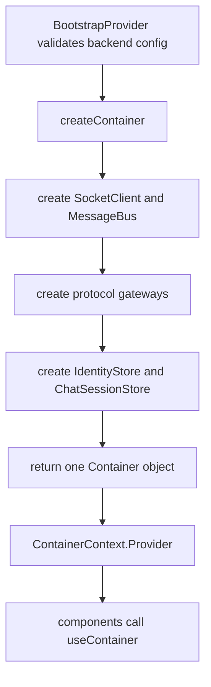
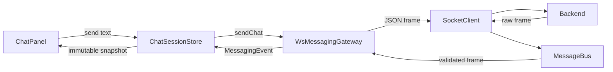
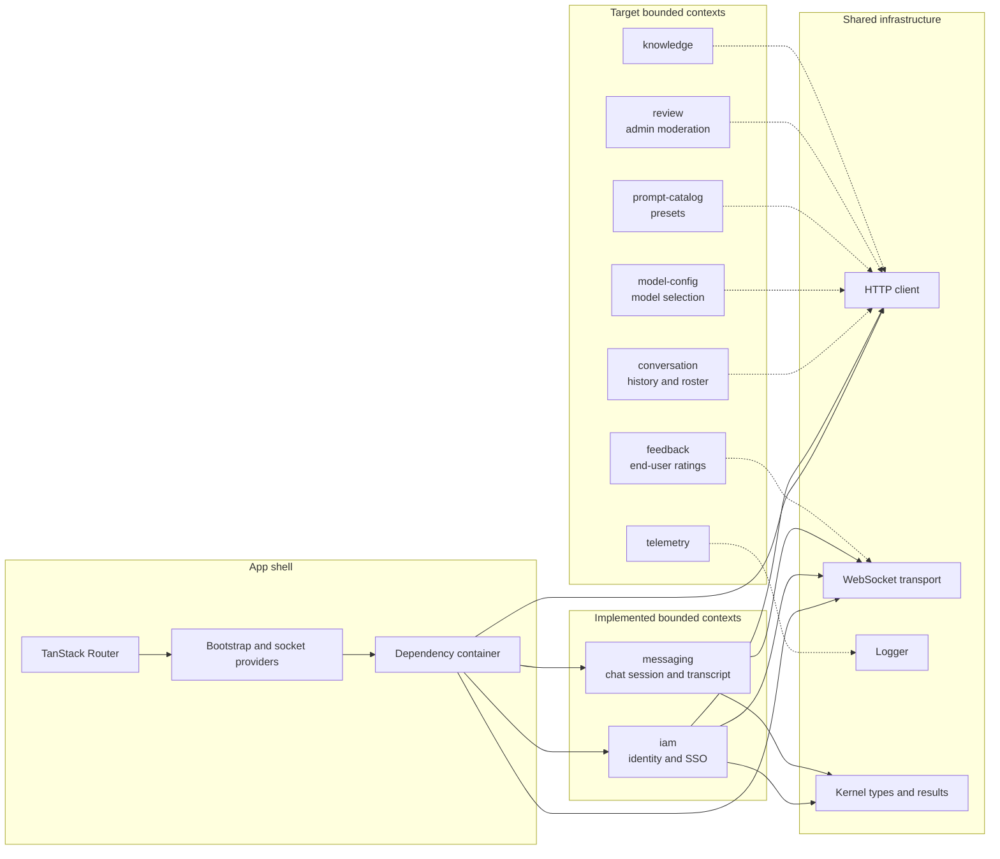
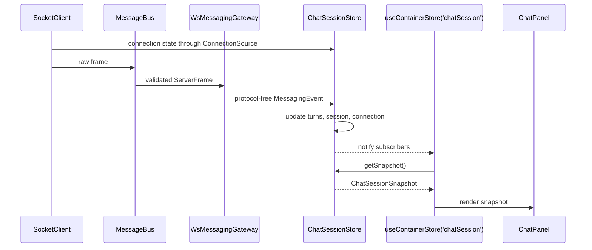

# Frontend Architecture

This frontend uses a layered, dependency-inverted architecture. React renders state, application stores coordinate use cases, and infrastructure adapters speak to the browser or backend.

## Repository map

This tree describes the current implementation. `src/` is production code only; every spec, fixture,
test double, type test and bench lives in `tests/`, which mirrors `src/` per bounded context
(`STD-002` §8.1). The `tests/` mirrors are omitted from the `src/` listing below for clarity.
`dist/`, `coverage/`, and `node_modules/` are generated and are not source architecture.

```text
auto-bedrock-chat-fastapi/frontend/          # Co-located with the FastAPI package that serves it (BC-002).
├── .tanstack/                           # Generated TanStack Router working data and caches.
├── coverage/                            # Generated unit-test coverage reports.
├── dist/                                # Generated production build output.
├── node_modules/                        # Installed third-party packages.
├── docs/                                # Short maintainers' guides for the implemented system.
│   ├── architecture.md                 # This architecture overview and source map.
│   └── websocket-and-chat-state.md     # Detailed WebSocket, gateway, and chat-state flow.
├── eslint/                              # Project-specific lint architecture and policy enforcement.
│   └── rules/                           # Local ESLint rule implementations.
├── public/                              # Static files copied into the production bundle unchanged.
├── scripts/                             # Executable repository and build validation checks.
├── specs/                               # Normative product and engineering documentation.
│   ├── contracts/                       # Frontend/backend API contracts and backend change requests.
│   ├── delivery/                        # Migration plan, work backlog, and requirement traceability.
│   ├── design/                          # Domain model and target application architecture.
│   │   └── decisions/                   # Accepted architecture decision records (ADRs).
│   ├── specs/                           # Functional and non-functional requirements by capability.
│   └── standards/                       # Tooling, coding, and testing standards.
├── tests/                               # Every spec, fixture, test double, type test, and bench.
│   ├── domains/<context>/                # Mirror of src/domains/<context>/, path for path.
│   │   └── {domain,application,infrastructure,presentation}/ # Mirrors the layer it covers.
│   ├── domains/_lint-check/              # Synthetic context used only to test architecture linting.
│   │   └── domain/violations.ts          # Imports that architecture tests expect lint to reject.
│   ├── app/                              # Mirror of src/app/.
│   ├── shared/                           # Mirror of src/shared/, including the shared test doubles.
│   ├── components/                       # Mirror of src/components/.
│   ├── e2e/                             # Selenium browser journeys and accessibility checks.
│   │   ├── __screenshots__/             # Visual-regression reference and failure images.
│   │   └── helpers/                     # WebDriver, axe, and visual-snapshot helpers.
│   ├── lint/                            # Tests proving custom lint architecture rules.
│   ├── msw/                             # Shared Mock Service Worker contract-test server.
│   │   ├── fixtures/                    # Representative backend HTTP and WebSocket payloads.
│   │   │   └── ws/                      # Captured or representative WebSocket frame fixtures.
│   │   └── handlers/                    # Reusable mocked backend request handlers.
│   └── setup/                           # Global Jest matcher and jsdom initialization.
├── src/                                 # Authored browser application source.
│   ├── main.tsx                        # Browser entry point; mounts AppRoot in React StrictMode.
│   ├── index.css                       # Tailwind imports, design tokens, themes, and global styles.
│   ├── routeTree.gen.ts                # Generated TanStack route tree; never edit by hand.
│   ├── assets/                          # Images imported and bundled by application modules.
│   │   └── hero.png                    # Bundled bitmap asset.
│   ├── app/                            # Composition root and application-wide orchestration.
│   │   ├── AppRoot.tsx                 # Orders global providers, router, overlays, and socket host.
│   │   ├── browser-location.ts         # Browser URL adapter used behind a narrow location API.
│   │   ├── placeholder-page.tsx        # Temporary page for routes whose context is not built yet.
│   │   ├── route-links.ts              # Typed route destinations shared by navigation callers.
│   │   ├── router.tsx                  # Creates and configures the TanStack Router instance.
│   │   ├── search-params.ts            # Reusable Zod schemas for URL search parameters.
│   │   ├── adapters/                    # Browser/library implementations of the shared UI ports.
│   │   │   ├── browser-connectivity-port.ts # Adapts browser online/offline events.
│   │   │   ├── confirmation-controller.ts # Promise-based confirmation state controller.
│   │   │   └── sonner-notification-port.ts # Implements notifications with Sonner toasts.
│   │   ├── bootstrap/                   # Startup boundary: validates config and builds dependencies.
│   │   │   ├── BootstrapProvider.tsx   # Loads bootstrap data and exposes the dependency container.
│   │   │   ├── bootstrap-config.dto.ts # Validates wire data and maps it to the app bootstrap model.
│   │   │   ├── chat-bootstrap.ts       # Protocol-free bootstrap configuration types.
│   │   │   ├── container-context.ts    # React context, fail-fast useContainer, and useContainerStore.
│   │   │   ├── container.ts            # Composition root that constructs adapters and stores.
│   │   │   └── loadBootstrap.ts        # Fetches and parses the backend bootstrap endpoint.
│   │   ├── chat/                        # Chat-screen glue composing conversation, messaging, and prompt UI.
│   │   ├── layouts/                     # Route-level chat and admin page frames.
│   │   │   ├── AdminLayout.tsx         # Admin shell, navigation, access handling, and boundary.
│   │   │   ├── AppShell.tsx            # Shared responsive application frame.
│   │   │   ├── ChatLayout.tsx          # Chat shell, header, sidebar, and route boundary.
│   │   │   └── use-document-title.ts   # Document-title hook used by both layouts.
│   │   ├── providers/                   # React owners of application-wide resource lifecycles.
│   │   │   ├── ChatSocketProvider.tsx  # Connects and disposes the app-wide WebSocket.
│   │   │   ├── ConfirmationHost.tsx    # Renders queued application confirmation requests.
│   │   │   ├── ThemeProvider.tsx       # Owns theme selection and system-theme synchronization.
│   │   │   └── theme-context.ts        # Theme context contract and consumer hook.
│   │   └── theme/                       # Pre-React theme initialization and CSP support.
│   │       └── theme-bootstrap.ts      # Pre-paint theme script and its CSP hash.
│   ├── components/                      # Reusable visual building blocks with no business ownership.
│   │   └── ui/                          # Owned shadcn/Base UI primitive source.
│   │       ├── accordion.tsx           # Generated accordion primitive.
│   │       ├── alert.tsx               # Generated alert primitive.
│   │       ├── alert-dialog.tsx        # Generated alert-dialog primitive.
│   │       ├── avatar.tsx              # Generated avatar primitive.
│   │       ├── badge.tsx               # Generated badge primitive.
│   │       ├── button.tsx              # Generated button primitive and variants.
│   │       ├── card.tsx                # Generated card primitive.
│   │       ├── checkbox.tsx            # Generated checkbox primitive.
│   │       ├── collapsible.tsx         # Generated collapsible primitive.
│   │       ├── command.tsx             # Generated command-palette primitive.
│   │       ├── dialog.tsx              # Generated modal-dialog primitive.
│   │       ├── dropdown-menu.tsx       # Generated dropdown-menu primitive.
│   │       ├── input-group.tsx         # Generated compound input layout.
│   │       ├── input.tsx               # Generated text-input primitive.
│   │       ├── label.tsx               # Generated form-label primitive.
│   │       ├── popover.tsx             # Generated popover primitive.
│   │       ├── radio-group.tsx         # Generated radio-group primitive.
│   │       ├── scroll-area.tsx         # Generated styled scroll-area primitive.
│   │       ├── select.tsx              # Generated select primitive.
│   │       ├── separator.tsx           # Generated visual separator.
│   │       ├── sheet.tsx               # Generated edge-panel primitive.
│   │       ├── skeleton.tsx            # Generated loading-placeholder primitive.
│   │       ├── slider.tsx              # Generated slider primitive.
│   │       ├── sonner.tsx              # Generated Sonner toaster bridge.
│   │       ├── switch.tsx              # Generated switch primitive.
│   │       ├── table.tsx               # Generated table primitives.
│   │       ├── tabs.tsx                # Generated tabs primitives.
│   │       ├── textarea.tsx            # Generated multiline-input primitive.
│   │       ├── tooltip.tsx             # Generated tooltip primitive.
│   │       └── composed/                # App-specific compositions built from UI primitives.
│   │           ├── confirm-dialog.tsx  # App-level confirmation dialog composition.
│   │           ├── empty-state.tsx     # Consistent empty-content state.
│   │           ├── error-boundaries.tsx # Route and overlay error-boundary compositions.
│   │           ├── error-state.tsx     # Recoverable error presentation.
│   │           ├── loading-state.tsx   # Consistent loading presentation.
│   │           ├── offline-banner.tsx  # Connectivity status announcement.
│   │           └── prompt-dialog.tsx   # App-level text-prompt dialog composition.
│   ├── domains/                        # Business capabilities, each sliced into four layers.
│   │   ├── iam/                        # Implemented identity and access context.
│   │   │   ├── domain/                  # Pure IAM values, policies, and authorization rules.
│   │   │   │   ├── auth-policy.ts      # Derives allowed authentication behavior.
│   │   │   │   ├── capabilities.ts     # Admin capability value types and defaults.
│   │   │   │   ├── credential-policy.ts # Validates credential fields and custom headers.
│   │   │   │   ├── credential.ts       # Credential variants and constructors.
│   │   │   │   ├── principal.ts        # Authenticated principal and authorization helpers.
│   │   │   │   └── public.ts           # Only IAM module other contexts may import.
│   │   │   ├── application/             # IAM session state, use cases, and required ports.
│   │   │   │   ├── admin-access-denied.ts # Builds access-denied state for admin routes.
│   │   │   │   ├── auth-deep-link.ts   # Resolves authentication-method URL intents.
│   │   │   │   ├── auth-session.ts     # Authentication session reducer and invariants.
│   │   │   │   ├── identity.store.ts   # Owns credentials and the live identity snapshot.
│   │   │   │   └── ports.ts            # Auth, SSO, and capability interfaces.
│   │   │   ├── infrastructure/          # HTTP and WebSocket adapters implementing IAM ports.
│   │   │   │   ├── capability-http.probe.ts # Loads and caches server capabilities.
│   │   │   │   ├── sso-http.gateway.ts # Handles SSO navigation and HTTP logout.
│   │   │   │   ├── ws-auth.gateway.ts  # Maps credentials and auth events to WebSocket frames.
│   │   │   │   └── dto/                 # IAM wire schemas and transport-to-domain mappers.
│   │   │   │       └── capabilities.dto.ts # Validates capability endpoint responses.
│   │   │   └── presentation/            # IAM React components and store subscription hooks.
│   │   │       ├── AuthDialog.tsx       # Authentication method and credential dialog.
│   │   │       ├── AuthDialogHost.tsx   # Connects identity state to the global auth dialog.
│   │   │       ├── AuthStatusButton.tsx # Header identity status and auth actions.
│   │   │       ├── access-denied-state.tsx # Admin authorization failure view.
│   │   │       ├── dev-mode-banner.tsx # Indicates development authentication mode.
│   │   │       ├── useCredentialDraft.ts # Local credential-form draft state.
│   │   │       ├── useInertAppRoot.ts   # Makes background content inert during auth.
│   │   │       └── credential-forms/     # Forms for every supported authentication method.
│   │   │           ├── ApiKeyForm.tsx   # API-key credential fields.
│   │   │           ├── BasicAuthForm.tsx # Username/password credential fields.
│   │   │           ├── BearerTokenForm.tsx # Bearer-token credential field.
│   │   │           ├── CredentialKindSelect.tsx # Authentication-method selector.
│   │   │           ├── CredentialTextField.tsx # Shared credential input wrapper.
│   │   │           ├── CustomHeadersForm.tsx # Custom-header JSON credential fields.
│   │   │           ├── OAuth2Form.tsx   # OAuth client credential fields.
│   │   │           ├── SsoLoginPanel.tsx # SSO login action.
│   │   │           └── credential-form.ts # Shared form types and credential mapping.
│   │   └── messaging/                  # Implemented live chat context.
│   │       ├── domain/                  # Pure messages, turns, transcripts, and connection rules.
│   │       │   ├── connection.ts       # Maps transport state to a UI-facing connection view.
│   │       │   ├── message.ts          # Chat message model and constructor.
│   │       │   ├── public.ts           # Only messaging module other contexts may import.
│   │       │   ├── socket-url.ts       # Safely resolves WebSocket URLs against the page URL.
│   │       │   ├── transcript.ts       # Produces ordered transcript entries from chat state.
│   │       │   └── turn.ts             # Turn state machine and transition rules.
│   │       ├── application/             # Chat session state, commands, events, and ports.
│   │       │   ├── chat-session.store.ts # Chat read model, actions, and external-store API.
│   │       │   └── ports.ts            # Messaging event, gateway, and connection interfaces.
│   │       ├── infrastructure/          # WebSocket adapter implementing the messaging port.
│   │       │   └── ws-messaging.gateway.ts # Translates WebSocket frames into messaging events.
│   │       └── presentation/            # Chat React components and subscription hooks.
│   │           ├── ChatPanel.tsx        # Composes connection, transcript, and composer UI.
│   │           ├── ConnectionBadge.tsx  # Displays current connection state.
│   │           ├── MessageComposer.tsx  # Message input and send behavior.
│   │           └── Transcript.tsx       # Renders chat transcript entries.
│   ├── lib/                              # shadcn CLI defaults only.
│   │   └── utils.ts                    # shadcn class-name merge helper.
│   ├── routes/                         # Thin file-based URL adapters for TanStack Router.
│   │   ├── __root.tsx                  # Root route context, boundaries, and not-found view.
│   │   ├── index.tsx                   # New-chat route at /chat/ui/.
│   │   ├── c.$conversationId.tsx       # Conversation route; currently a placeholder.
│   │   └── admin/                       # Lazy-loaded, capability-guarded admin route subtree.
│   │       ├── route.tsx               # Admin layout and capability guard.
│   │       ├── index.tsx               # Redirects /admin to the feedback queue.
│   │       ├── feedback.index.tsx      # Feedback queue route and search schema; placeholder.
│   │       ├── feedback.reviewed.tsx   # Reviewed-feedback route and schema; placeholder.
│   │       ├── feedback.stats.tsx      # Feedback-statistics route and schema; placeholder.
│   │       ├── knowledge.tsx           # Knowledge-base route and schema; placeholder.
│   │       └── usage.tsx               # Usage-analytics route and schema; placeholder.
│   └── shared/                         # Context-neutral types, ports, and technical adapters.
│       ├── copy/                        # Centralized user-facing text and parity corpus.
│       │   ├── README.md               # Copy ownership and usage rules.
│       │   ├── confirmations.ts        # Confirmation-dialog strings.
│       │   ├── iam.ts                  # Identity and authentication strings.
│       │   ├── legacy-strings.json     # Legacy parity corpus checked by scripts.
│       │   ├── messaging.ts            # Chat and connection strings.
│       │   └── shell.ts                # App shell, route, and error strings.
│       ├── http/                        # Framework-neutral HTTP client and failure handling.
│       │   ├── exception.ts            # Normalized HTTP and network problem types.
│       │   ├── http-client.ts          # Fetch wrapper with abort, parsing, and retry support.
│       │   └── retry-policy.ts         # HTTP method type, retry eligibility, and backoff calculation.
│       ├── kernel/                      # Small stable types shared across bounded contexts.
│       │   ├── branded.ts              # Branded identifier types and constructors.
│       │   ├── curation.ts             # Shared review/knowledge curation value objects.
│       │   ├── domain-event.ts         # Domain-event types and in-memory publisher.
│       │   ├── instant.ts              # Time value objects and injectable clocks.
│       │   └── result.ts               # Result type and success/error helpers.
│       ├── logging/                     # Structured logging contract and browser adapter.
│       │   ├── console-logger.ts       # Structured browser-console logging adapter.
│       │   └── logger.ts               # Logger interface and context types.
│       ├── markdown/                    # Sanitized Markdown rendering shared by contexts.
│       │   ├── sanitize-schema.ts      # Single HTML sanitization allow-list.
│       │   └── sanitized-markdown.tsx  # Safe Markdown rendering pipeline.
│       ├── ports/                       # Context-neutral UI service contracts.
│       │   ├── confirmation-port.ts    # Confirmation and prompt request interface.
│       │   ├── connectivity-port.ts    # Online/offline status interface.
│       │   └── notification-port.ts    # Transient notification interface.
│       └── ws/                          # Protocol-neutral socket transport and frame bus.
│           ├── message-bus.ts          # Parses, validates, owns, and publishes server frames.
│           ├── reconnect-policy.ts     # Bounded reconnect backoff with jitter.
│           └── socket-client.ts        # Protocol-agnostic WebSocket lifecycle and transport.
├── components.json                     # shadcn generation configuration.
├── eslint.config.js                    # Project lint configuration entry point.
├── index.html                          # Static HTML shell and pre-paint theme bootstrap.
├── jest/                               # Jest ESM transformer, jsdom environment, and asset stubs.
├── jest.config.js                      # Unit, component, contract, lint, bench, and e2e projects.
├── package.json                        # Dependencies and development/build/test commands.
├── tsconfig*.json                      # TypeScript projects for app, Node config, and references.
└── vite.config.ts                      # Vite plugins, proxying, route splitting, and build output.
```

Only `iam` and `messaging` are implemented bounded contexts today. `conversation`,
`prompt-catalog`, `model-config`, `feedback`, `review`, `knowledge`, and `telemetry` are target
contexts described by `specs/`; their routes remain placeholders until those slices land.

### Folder responsibilities

| Folder | What it contains | Architectural meaning |
| --- | --- | --- |
| `.git/` | Git objects, refs, and local repository state. | Version-control metadata, outside the application architecture. |
| `.tanstack/` | TanStack Router temporary output. | Generated tooling state; do not treat it as source. |
| `coverage/`, `dist/`, `node_modules/` | Reports, production bundles, and installed packages. | Reproducible generated output, not authored application code. |
| `docs/` | Short explanations of the implemented system. | Descriptive guidance that must stay synchronized with code. |
| `eslint/` | Boundary configuration, alias resolution, and local rules. | Executable architecture policy that prevents invalid dependencies. |
| `eslint/rules/` | Project-specific ESLint rules. | Static enforcement for conventions not covered by standard plugins. |
| `public/` | Favicons and shared SVG symbols. | Static deployment assets that bypass module bundling. |
| `scripts/` | Copy-parity and chunk-splitting checks. | Build-time assertions for requirements that typecheck and lint cannot prove. |
| `specs/` | Requirements, designs, contracts, standards, and plans. | Normative target architecture and product behavior. |
| `specs/contracts/` | Backend API contract and requested backend changes. | Defines the frontend's external service boundary. |
| `specs/delivery/` | Migration sequence, task backlog, and traceability. | Connects requirements to implementation work and evidence. |
| `specs/design/` | Domain model and architecture design. | Defines context boundaries, layers, and target structure. |
| `specs/design/decisions/` | Architecture decision records. | Preserves the reasons behind important structural choices. |
| `specs/specs/` | Capability-specific functional requirements. | Defines behavior each bounded context must eventually implement. |
| `specs/standards/` | Tooling, coding, and testing rules. | Shared engineering constraints for all modules. |
| `tests/` | Every spec, fixture, test double, type test, and bench. | The whole verification tree; `src/` holds production code only. |
| `tests/domains/<context>/`, `tests/{app,shared,components}/` | Per-context and per-area mirrors of the matching `src/` path. | Declared as the same lint element as their subject, so layer and context rules apply to a spec exactly as to the module it covers. |
| `tests/domains/_lint-check/` | Synthetic invalid context fixture. | Test input for dependency-boundary enforcement, never production behavior. |
| `tests/e2e/` | Selenium browser, keyboard, accessibility, and smoke journeys. | Validates complete user workflows in a running application. |
| `tests/e2e/helpers/` | WebDriver, axe, and visual comparison utilities. | Shared browser-test infrastructure. |
| `tests/e2e/__screenshots__/` | Visual baselines and failure captures. | Generated or reviewed evidence for visual regression checks. |
| `tests/lint/` | Tests for custom lint rules and boundaries. | Proves architecture enforcement accepts and rejects the right imports. |
| `tests/msw/` | Mock Service Worker server and contract suites. | Simulates backend boundaries with controlled wire data. |
| `tests/msw/fixtures/` | Representative HTTP and WebSocket payloads. | Reusable wire-level contract examples. |
| `tests/msw/fixtures/ws/` | WebSocket frame fixtures. | Contract evidence for message parsing and ownership. |
| `tests/msw/handlers/` | Reusable mock HTTP handlers. | Backend behavior used by integration and contract tests. |
| `tests/setup/` | Global jsdom and matcher initialization. | Establishes the shared component-test runtime. |
| `src/` | All authored browser application code. | The production module graph compiled by TypeScript and Vite. |
| `src/assets/` | Images imported by source modules. | Assets processed, hashed, and referenced by the bundler. |
| `src/app/` | Providers, layouts, routing, and concrete dependency assembly. | Application shell and composition root; coordinates contexts without owning business rules. |
| `src/app/bootstrap/` | Config DTO, loader, provider, container, and context. | Startup boundary that validates backend configuration, constructs dependencies, and exposes only a ready container. `useContainerStore(key)` is the one subscription hook for every store in it. |
| `src/app/adapters/` | Browser connectivity, Sonner notification, and confirmation-controller adapters. | Production implementations of the `src/shared/ports/` contracts, wired by the container. |
| `src/app/chat/` | Chat-screen composition: conversation view, drawer, prompt-catalog area, route sync. | Glue that composes several contexts' presentation for the chat routes; owns no business rules. |
| `src/app/layouts/` | App shell, chat and admin shells, document-title hook. | Route-level framing shared by pages in each application area. |
| `src/app/providers/` | Socket, theme, and confirmation-host providers. | React ownership boundary for long-lived application resources and global overlays. |
| `src/app/theme/` | Pre-paint theme bootstrap and CSP hash. | Prevents theme flash before React starts while preserving CSP. |
| `src/components/` | Reusable visual components. | UI layer with no bounded-context business ownership. |
| `src/components/ui/` | Generated and owned shadcn/Base UI primitives. | Lowest reusable visual layer available to presentation code. |
| `src/components/ui/composed/` | State, boundary, dialog, table, and drawer compositions. | App-specific reusable patterns assembled from primitives. |
| `src/domains/` | Business capability modules. | Bounded contexts isolated by lint and organized into four layers. |
| `src/domains/iam/` | Authentication, identity, SSO, and capabilities. | Implemented identity and access bounded context. |
| `src/domains/iam/domain/` | Credentials, principals, capabilities, and policies. | Pure IAM rules with no React, browser, or transport dependency. |
| `src/domains/iam/application/` | Identity store, session reducer, use cases, and ports. | Coordinates IAM behavior and declares infrastructure needs. |
| `src/domains/iam/infrastructure/` | HTTP/WebSocket adapters and DTO mapping. | Implements IAM application ports against external systems. |
| `src/domains/iam/infrastructure/dto/` | Capability response validation. | Anti-corruption boundary between wire data and IAM models. |
| `src/domains/iam/presentation/` | Authentication components and hooks. | Renders IAM state and invokes IAM application actions. |
| `src/domains/iam/presentation/credential-forms/` | Forms for each authentication method. | Collects credentials without moving validation or session rules into generic UI. |
| `src/domains/messaging/` | Live chat session and transcript behavior. | Implemented messaging bounded context. |
| `src/domains/messaging/domain/` | Messages, turns, transcripts, connection views, and URL rules. | Pure messaging state and invariants. |
| `src/domains/messaging/application/` | Chat session store and ports. | Coordinates messaging commands and protocol-free events. |
| `src/domains/messaging/infrastructure/` | WebSocket messaging gateway. | Translates validated frames into messaging application events. |
| `src/domains/messaging/presentation/` | Chat panel, transcript, composer, and status. | Renders messaging snapshots and invokes messaging actions. Components subscribe via `useContainerStore('chatSession')`; there is no per-context hook file. |
| `src/lib/` | shadcn `cn` helper. | The shadcn CLI default location; nothing else lives here. |
| `src/routes/` | TanStack Router route definitions. | Thin URL adapters that delegate rendering and behavior to contexts. |
| `src/routes/admin/` | Guarded, lazy admin routes and search schemas. | Admin route boundary; most pages remain placeholders until their contexts land. |
| `src/shared/` | Stable cross-context types and technical ports. | Shared kernel and infrastructure with no business-context ownership. |
| `src/shared/copy/` | User-facing text and legacy parity corpus. | Single ownership point for copy, localization readiness, and parity checks. |
| `src/shared/http/` | HTTP client, normalized errors, methods, and retries. | Reusable transport infrastructure consumed by context adapters. |
| `src/shared/kernel/` | Results, identifiers, time, events, and curation values. | Minimal stable language that bounded contexts may share. |
| `src/shared/logging/` | Logger port and console adapter. | Structured observability without direct `console` dependencies elsewhere. |
| `src/shared/markdown/` | Markdown renderer and sanitization schema. | Single safe rendering boundary for backend or model-authored content. |
| `src/shared/ports/` | Confirmation, connectivity, and notification ports. | Context-neutral UI service contracts implemented in `src/app/adapters/`. |
| `src/shared/ws/` | Socket client, frame bus, and reconnect policy. | Protocol-neutral WebSocket lifecycle and validation dispatch. |

## Core terms in this application

### Container and composition

The `Container` is a plain TypeScript object containing references to the long-lived services,
adapters, and stores used by the application. It is not a Docker container, a UI element, or a
second runtime. It answers a practical question: **which concrete objects make up this running
frontend, and which instances should they share?**

| Term | Meaning here |
| --- | --- |
| **Container** | The typed object returned by `createContainer`; it holds the shared HTTP client, socket, message bus, gateways, stores, logger, clock, configuration, and UI service ports. |
| **Composition root** | The one place, `createContainer`, where concrete classes are instantiated and connected. Business modules receive dependencies from here instead of constructing infrastructure themselves. |
| **Compose** | Construct an object and provide the objects it depends on; for example, `new WsMessagingGateway(socket, messageBus)`, followed by `new ChatSessionStore({ gateway: messagingGateway, connection: socket, ... })`. |
| **Dependency injection** | Passing the gateway, socket view, clock, or logger into a store rather than making the store import and construct those concrete objects. |
| **Expose the container** | Put the completed object into `ContainerContext.Provider`, making the same instances available to descendant React components through `useContainer()`. It does **not** expose them over HTTP, WebSocket, or outside the browser. |

The construction order is important:



The container owns references, but it does not perform all the work itself. Calling
`chatSession.send(text)` invokes the store; the store calls its injected gateway; the gateway calls
the shared socket. The container merely assembled those collaborating objects and made them
reachable.

### Gateways

A gateway is an adapter at the edge of a bounded context. Application code speaks through a small
interface called a **port**; the gateway implements that interface by translating to and from an
external protocol. This prevents stores and domain rules from depending on JSON frame names,
snake-case backend fields, `fetch`, or `WebSocket`.

| Application port | Concrete gateway | Translation performed |
| --- | --- | --- |
| `MessagingGateway` | `WsMessagingGateway` | Converts `sendChat(text)` into a WebSocket `chat` frame and converts validated server frames into `MessagingEvent` values such as `answered` or `failed`. |
| `AuthGateway` | `WsAuthGateway` | Converts credentials and logout commands into WebSocket frames and converts authentication frames into protocol-free auth events. |
| `SsoGateway` | `SsoHttpGateway` | Converts login/logout use cases into browser navigation and an authenticated HTTP logout request. |
| `CapabilityProbe` | `CapabilityHttpProbe` | Fetches, validates, maps, and caches the backend's admin capabilities. |

For messaging, the outbound and inbound paths are deliberately symmetrical:



`MessageBus` and a gateway have different jobs. The bus parses and validates frames once, then
publishes them. A context gateway selects the frames relevant to that context and translates them
into its application language.

### Sessions, connections, conversations, and turns

The word “session” appears at several levels. They have different identities and lifetimes:

| Concept | Owner and lifetime | What it contains |
| --- | --- | --- |
| **Socket connection** | `SocketClient`; from connect until close/reconnect. | Transport state such as connecting, open, closed, and retry attempt. A reconnect creates a fresh backend socket session. |
| **Backend session ID** | Backend; received in `connection_established` and retained by `ChatSessionStore` only while that socket is open. | Identifies the current live WebSocket session; it is cleared when the connection closes. |
| **`ChatSessionStore`** | Frontend container; lives for the mounted application. | Current connection view, backend session ID, optimistic turns, transcript, pending-response state, and send rules. It is an in-memory application read model, not the persisted chat history. |
| **IAM `AuthSession`** | `IdentityStore`; lives for the mounted application. | Authentication UI and principal state such as configured, authenticated, expired, or dialog-open. Secret credentials remain private inside `IdentityStore`. |
| **Conversation** | Backend plus the future `conversation` context; survives individual socket connections. | Persisted message history identified by a conversation ID. It is not implemented as a frontend bounded context yet. |
| **Turn** | `ChatSessionStore`; from one user send until answer, failure, or abandonment. | One user message and its corresponding assistant outcome. |

In short: the **container** connects objects, a **gateway** translates across a system boundary, a
**store** coordinates application state and actions, a **socket session** represents one live
connection, and a **conversation** represents durable chat history.

## Application composition

`createContainer` is the composition root. It creates the concrete adapters once after bootstrap has loaded, then injects narrow interfaces into application services.

```mermaid
flowchart TD
    Bootstrap[BootstrapProvider\nconfig and identity] --> Container[createContainer\ncomposition root]

    Container --> Socket[SocketClient\nWebSocket lifecycle]
    Container --> Bus[MessageBus\nparse and validate frames]
    Container --> Identity[IdentityStore\nIAM state]
    Container --> Chat[ChatSessionStore\nchat read model]
    Container --> Gateway[WsMessagingGateway\nmessaging adapter]
    Container --> Auth[WsAuthGateway\nauth adapter]

    Socket --> Bus
    Socket --> Identity
    Socket --> Gateway
    Socket --> Auth
    Bus --> Gateway
    Bus --> Auth
    Gateway --> Chat
    Socket -. ConnectionSource .-> Chat

    Provider[ChatSocketProvider] --> Socket
    Hook[useContainerStore('chatSession')] --> Chat
    Panel[ChatPanel and child components] --> Hook
```

The dotted connection is intentional: `ChatSessionStore` sees only the `ConnectionSource` port, not the concrete socket class. The container happens to inject `SocketClient` because it implements that port.

## Bounded contexts

The app is organized by business capability. An implemented context owns its domain types,
application state and use cases, infrastructure adapters, and presentation components. Dashed
nodes and edges below show the target contexts that have not landed yet.



Within a context, presentation and infrastructure depend on interfaces declared by its application
layer. Cross-context imports are limited to the other context's `domain/public.ts`; shared concepts
belong in the shared kernel. UI components consume context hooks or stores rather than instantiate
infrastructure adapters.

## React state boundary

Stores are external state sources. `useSyncExternalStore` subscribes React to immutable snapshots and keeps rendering separate from transport callbacks.



The provider owns socket lifetime and the store owns chat state. `useContainerStore('chatSession')` exposes immutable
read snapshots; command handlers invoke application actions such as `chatSession.send(text)` on the
store obtained from the dependency container.
