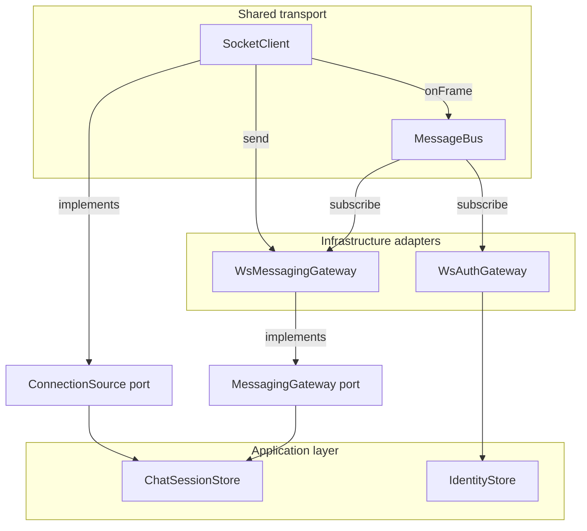
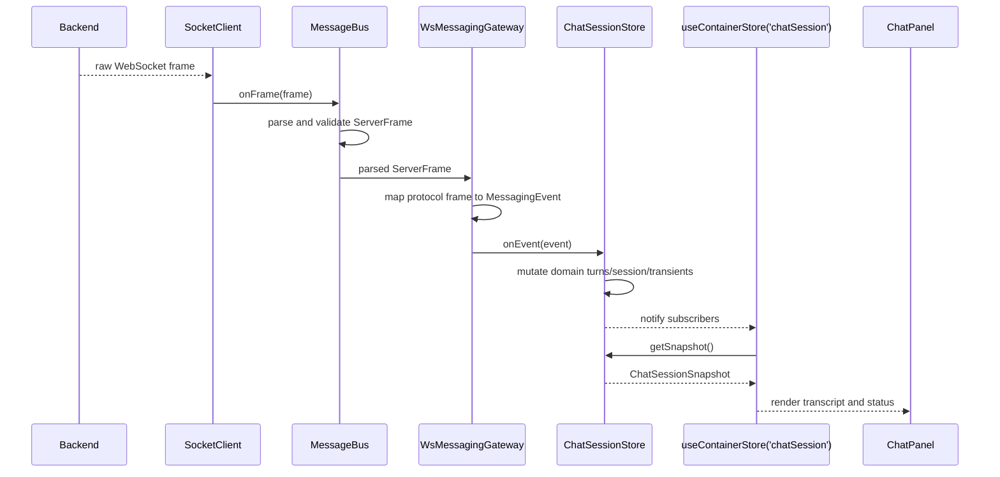
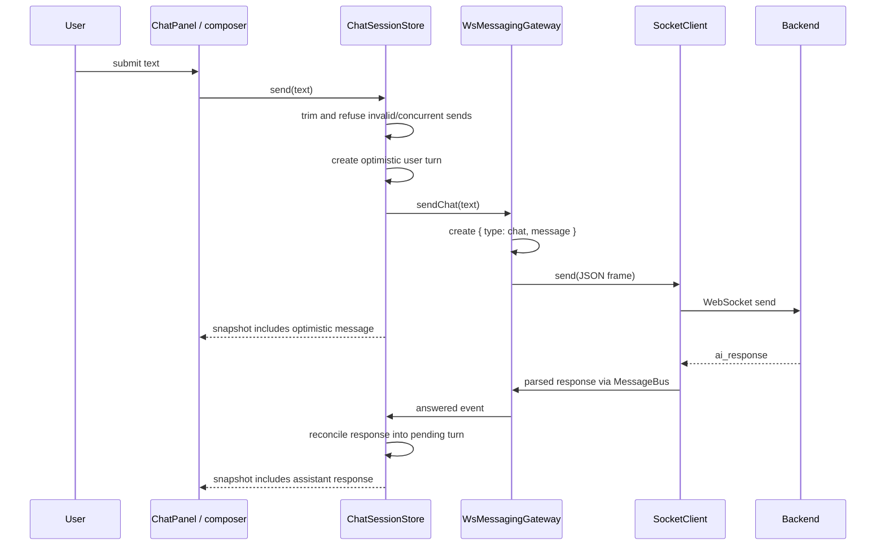
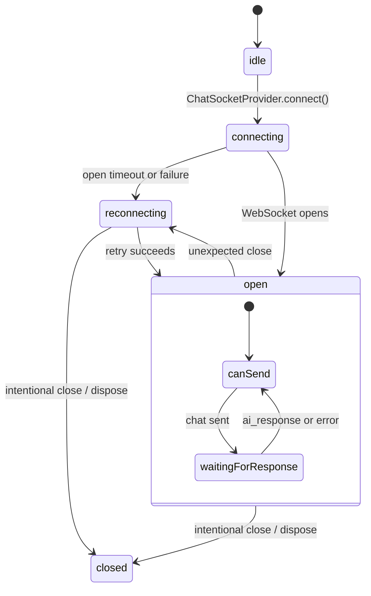

# WebSocket And Chat State

## Who calls whom?

The short answer is: `ChatSessionStore` does not directly call `SocketClient`.

It receives two ports:

- `MessagingGateway`: send chat messages and receive protocol-free messaging events.
- `ConnectionSource`: observe connection state.

`createContainer` injects adapters backed by the same `SocketClient`. This lets the store coordinate chat behavior without owning connection lifecycle.

`ChatSocketProvider` is the only component that calls `connect()` and `dispose()`. Route changes do not recreate the socket because the provider is mounted above the router.

## Incoming frame flow

A backend frame moves from the browser transport toward the UI as follows:

Examples of mapping:

| Backend frame | Domain event | Store behavior |
| --- | --- | --- |
| `connection_established` | `session-established` | Stores the session id |
| `ai_response` | `answered` | Resolves the pending optimistic turn |
| `ai_response` with `error` | `failed` | Fails the pending turn |
| `error` | `failed` | Fails the pending turn or shows a transient |
| `typing` | `typing` | Currently observes/logs the first frame only; streaming is a later phase |

Invalid frames are rejected by `MessageBus` and do not reach the store.

## Outgoing message flow

If the socket is closed, the send is not queued. The optimistic turn is marked abandoned and the caller receives `dropped-closed`.

## Connection state flow

`ChatSessionStore` reacts to connection state changes by:

- updating its connection view;
- clearing the session id when the connection is no longer open;
- abandoning an unresolved turn so the UI cannot remain waiting forever;
- emitting a new snapshot for React.

## State ownership summary

| Concern | Owner | React reads it through |
| --- | --- | --- |
| WebSocket open/retry/close | `SocketClient` | `ChatSessionStore` connection port |
| Frame validation and routing | `MessageBus` | Not directly |
| Protocol-to-domain translation | `WsMessagingGateway` | Not directly |
| Chat session, turns, transcript | `ChatSessionStore` | `useContainerStore('chatSession')` |
| Socket lifetime | `ChatSocketProvider` | Not applicable |
| Visual rendering | `ChatPanel`, `Transcript`, `ConnectionBadge` | Snapshot values |

This separation is the important mental model: transport emits facts, adapters translate them, the store decides application state, and React renders the resulting snapshot.
